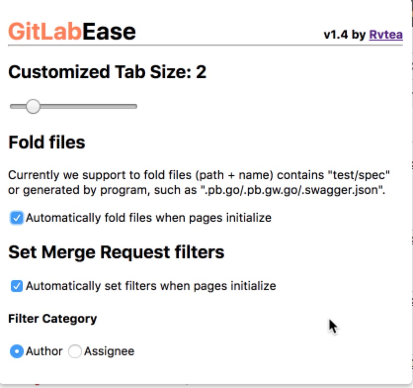

# GitLabEase
extension to make Gitlab Usage easier

### How to Use
0. git clone this repo
1. go to `chrome://extensions/`
2. enable developer mode
3. click `load unpacked`, choose this repo’s directory
4. all set, have fun

### Functionality
Most functionalities are based on the diff page as that is the most frequently used by ENGs.

* customized Tab size
  + I was thinking inject css dynamically while [Github Custom Tab Size](https://github.com/lukechilds/github-custom-tab-size) provide a more straight-forward way to do this. So I reuse most code logic here to update the tab size.
  + Be noted this can only work for code formatted with tab rather than whitespace, such as golang
* automatically fold some files
  + code reviewer might not need take a look at the first round reivew (code reviewer should focus on the code logic itself at first round), so we support auto folding file (path + name) contains with `test`, `spec`, `.pb.go`, `.pb.gw.go`, `.swagger.json`. The last 3 types file are generated files by protoc, which should be also folded for code reviewer.
  + if 1 MR only contains the special files mentioned above, then we should not fold them while keep them open, so we add support to gracefully handle this.
  + provide basic stats in console to report the fold action details
* automatically add filter for MR list page
  + in most times, dev or reviewer would go to merge request list page to search for MR (`author = currentUser`) or (`assignee = currentUser`). so we support auto filter in list page for them: default for `author`, but can be configured in popup dialog.